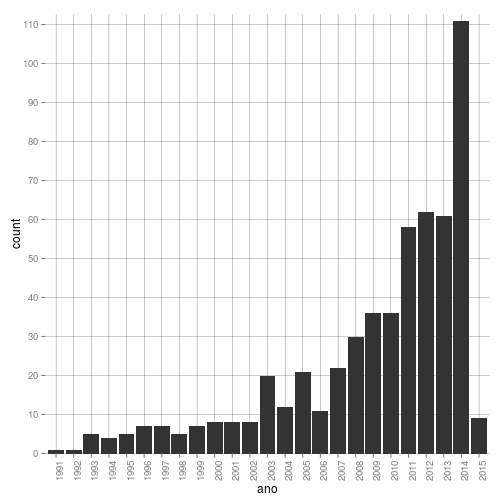
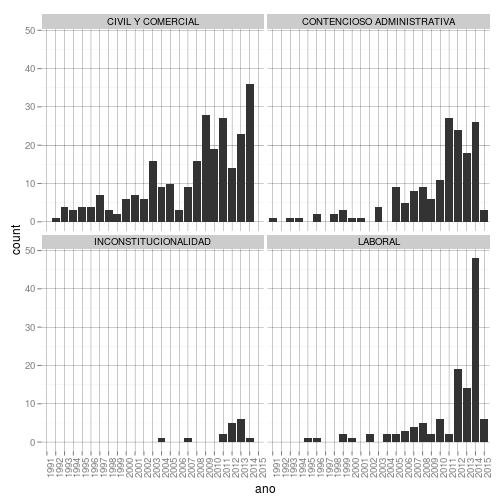
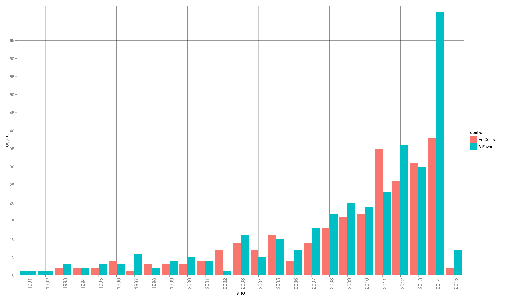
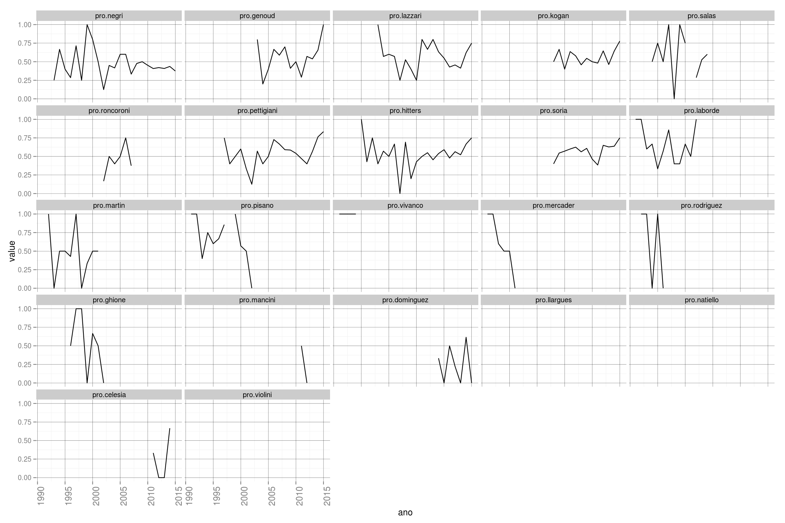
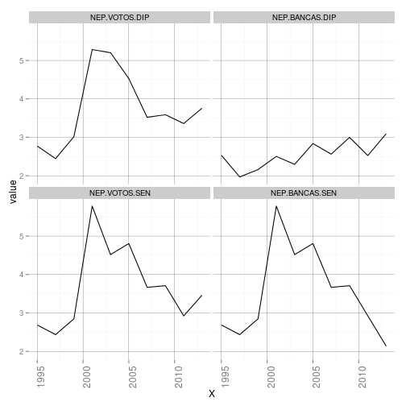

# SENTENCIAS SUPREMA CORTE DE BUENOS AIRES #

Análisis exploratorio de las sentencias definitivas de la Corte Suprema de Buenos Aires. El set de datos incluye solo aquellas causas en los que la administración pública a nivel provincial o municipal es parte. 

* Fuente: [JUBA](http://juba.scba.gov.ar/Busquedas.aspx ) 
* Período: 1991-2015
* N: 555

### Librerias utilizadas.

```r
library(knitr)
library(stringr)
library(ggplot2)
library(reshape2)
```

### Carga la base de datos

```r
load("/home/federico/Documents/SCBA/r/dataset.RData")
```

#### variable año.

```r
dataset$fecha <- as.Date(dataset$fecha,"%d-%m-%Y")
dataset$ano <- str_extract(dataset$fecha,"[0-9]{4}")
```

### Cantidad de sentencias por año.

```r
ggplot(dataset, aes(x=ano)) +
	geom_bar(position="dodge")+
	theme(axis.text.x = element_text(angle = 90, hjust = 1))+
	scale_y_discrete(breaks=seq(0, 110, 10))+
	theme(panel.background = element_rect(fill = "white"))+
	theme(panel.grid.major = element_line(colour = "black",size=0.1))
```

 

### Sentencias por materia.

```r
ggplot(dataset, aes(x=ano)) +
	geom_bar(position="dodge")+
	facet_wrap(~materia)+
	theme(axis.text.x = element_text(angle = 90, hjust = 1))+ 
	theme(panel.background = element_rect(fill = "white"))+
	theme(panel.grid.major = element_line(colour = "black",size=0.1))
```

 

### Top 10 principales voces.

```r
tabla.voces <- sort(table(dataset$voces),decreasing=TRUE)
tabla.voces[1:10]
```

```
## 
##        DAÑOS Y PERJUICIOS DEMANDA CONTENCIOSO ADMIN 
##                       163                       117 
##      ACCIDENTE DE TRABAJO                    AMPARO 
##                        45                        41 
##              EXPROPIACION                   APREMIO 
##                        40                        23 
##                ENFERMEDAD      INCONSTITUCIONALIDAD 
##                        16                        16 
##             INDEMNIZACION                 ACCIDENTE 
##                        16                        10
```

### Sentencias contra la administración provincial por año.

```r
dataset$contra <- dataset$afavor != dataset$resul
dataset$contra <- factor(dataset$contra, levels=c("TRUE","FALSE"), labels=c("En Contra","A Favor"))
ggplot(dataset, aes(x=ano,group=contra,fill=contra)) +
	geom_bar(position="dodge")+
	theme(axis.text.x = element_text(size=12,angle = 90, hjust = 1))+ 
	scale_y_discrete(breaks=seq(0, 65, 5))+
	theme(panel.background = element_rect(fill = "white"))+
	theme(panel.grid.major = element_line(colour = "black",size=0.1))
```

 

### Decisiones a favor y en contra de la administración pública por magistrado

#### Cálculo de proporciones

```r
tabla.pro <- sapply(dataset[,38:59],function(x) table(dataset$ano,x))
tabla.pro <- sapply(tabla.pro,function(x) prop.table(x,1))
pos <- lapply(tabla.pro,"[",1:25)
pos <- data.frame(sapply(pos,cbind))
pos$ano <- 1991:2015
pos.melt <- melt(pos, id.vars = "ano")
```


```r
ggplot(pos.melt, aes(x=ano,y=value)) +
	geom_line()+
	facet_wrap(~variable)+
	theme(axis.text.x = element_text(size=12,angle = 90, hjust = 1))+ 
	theme(panel.background = element_rect(fill = "white"))+
	theme(panel.grid.major = element_line(colour = "black",size=0.1))
```

 

# NUMERO EFECTIVO DE PARTIDOS 
Carga de los datos


```r
nep <- read.csv("/home/federico/Documents/SCBA/r/NEP.1995-2013.csv")
head(nep,10)
```

```
##       X NEP.VOTOS.DIP NEP.BANCAS.DIP NEP.VOTOS.SEN NEP.BANCAS.SEN
## 1  1995      2.770938       2.531100      2.684687       2.684687
## 2  1997      2.443364       1.966543      2.434906       2.434906
## 3  1999      3.016064       2.159184      2.844032       2.844032
## 4  2001      5.284199       2.501182      5.780254       5.780254
## 5  2003      5.202651       2.295011      4.516513       4.516513
## 6  2005      4.529660       2.836461      4.805740       4.805740
## 7  2007      3.520788       2.561743      3.666343       3.666343
## 8  2009      3.586858       2.997167      3.709525       3.709525
## 9  2011      3.357679       2.525060      2.921943       2.921943
## 10 2013      3.757084       3.090912      3.459830       2.135621
```

```r
nep.melt <- melt(nep, id.vars = "X")
ggplot(nep.melt, aes(x=X,y=value)) +
	geom_line()+
	facet_wrap(~variable)+
	theme(axis.text.x = element_text(size=12,angle = 90, hjust = 1))+ 
	theme(panel.background = element_rect(fill = "white"))+
	theme(panel.grid.major = element_line(colour = "black",size=0.1))
```

 


